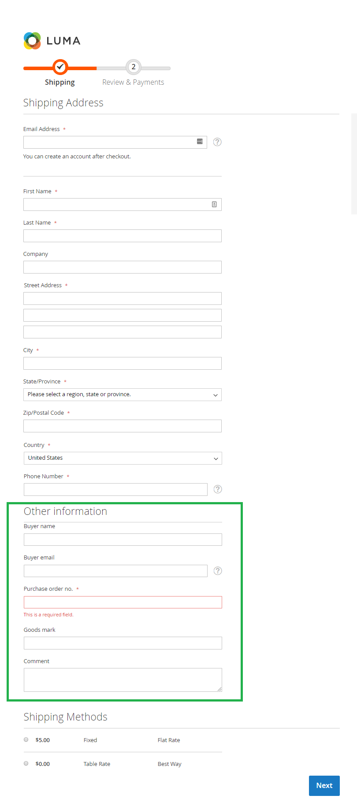
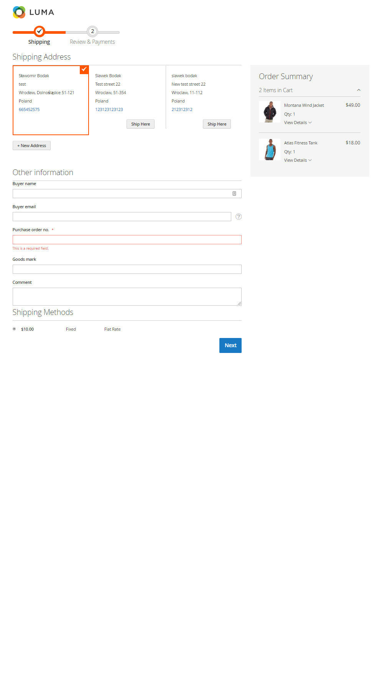
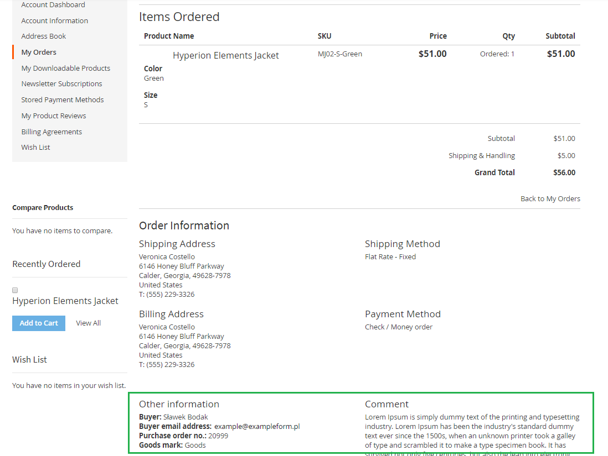
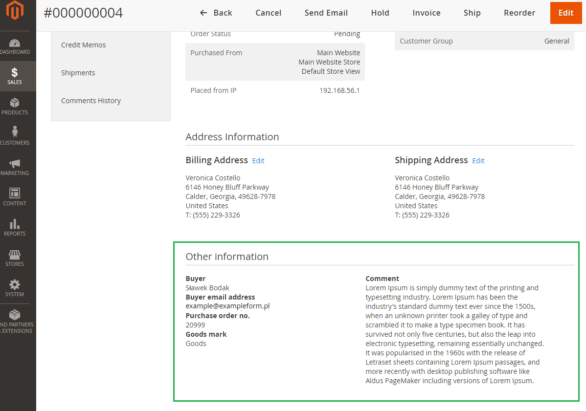

# Magento 2 - Checkout custom form
 
## Overview
Add a custom form fields to the Magento 2 checkout. The form will appear in the first checkout step (shipping step) above shipping methods.
The form is available for logged in customers and guests. After an order is placed all data are set in `sales_order` table.
Data are still in the form after page refreshed, till cart is active.

Form data will be set in a `quota` table through independent API request:
- `/V1/carts/mine/set-order-custom-fields` (for logged in customer)
- `/V1/guest-carts/:cartId/set-order-custom-field`  (for guest)

## Compatibility
- Tag 1.2.* => Magento 2.3
- Tag 1.1.* => Magento 2.1.x - 2.2.x (no longer supported)

## Requirements
- PHP 7.0 or higher

## Installation details
1. Run `composer require sbodak/magento2-checkout-custom-form`
2. Run `php bin/magento module:enable Bodak_CheckoutCustomForm`
3. Run `php bin/magento setup:upgrade`

### Sample custom form fields
- buyer
- buyer email address
- purchase order no.
- goods mark
- comments

### Modify form fields
- You need to modify service contract data interface in `Api/Data/CustomFieldsInterfaces.php`
- You need to modify table schema in `Setup/InstallData.php`
- You need to add new fields to observer `Observer/AddCustomFieldsToOrder.php` which save data in quota and sales table
- You need to add new item in `view/frontend/layout/checkout_index_index.xml`
- You need to modify the methods in `Model/Data/CustomFields.php`
- You need to modify the methods in `Model/CustomFieldsRepository.php`

```
<item name="custom-checkout-form-fieldset" xsi:type="array">
    <item name="component" xsi:type="string">uiComponent</item>
    <item name="displayArea" xsi:type="string">custom-checkout-form-fields</item>
    <item name="children" xsi:type="array">
        [... place here new definition of your field]
    </item>
</item>
```

Check official documentation: https://devdocs.magento.com/guides/v2.3/howdoi/checkout/checkout_form.html

- You need to modify template views in `view/frontend/templates/order/view/custom_fields.phtml` (for customer account) 
and `view/adminhtml/templates/order/view/custom_fields.phtml (for admin panel)`.
- Checkout form view is generated automatically using Ui Components

### Required entry
If you want to make field required, check this example:
```
<item name="checkout_purchase_order_no" xsi:type="array">
    <item name="component" xsi:type="string">Magento_Ui/js/form/element/abstract</item>
    <item name="config" xsi:type="array">
        <item name="customScope" xsi:type="string">customCheckoutForm</item>
        <item name="template" xsi:type="string">ui/form/field</item>
        <item name="elementTmpl" xsi:type="string">ui/form/element/input</item>
    </item>
    <item name="validation" xsi:type="array">
        <item name="required-entry" xsi:type="boolean">true</item>
    </item>
    <item name="provider" xsi:type="string">checkoutProvider</item>
    <item name="dataScope" xsi:type="string">customCheckoutForm.checkout_purchase_order_no</item>
    <item name="label" xsi:type="string">Purchase order no.</item>
    <item name="sortOrder" xsi:type="string">3</item>
</item>
```

### Fast fields override 
You can modify `i18n/en_US.csv` translation to change field names.

### Checkout view - custom form - Guest


### Checkout view - custom form - Logged in


### Custom account - Order history view


### Admin panel - Order Edit



## Uninstall
To remove this module run `php bin/magento module:uninstall Bodak_CheckoutCustomForm`.
It will remove all data and drop columns in `sales_order` and `quote` tables.

## License
[MIT License](LICENSE)